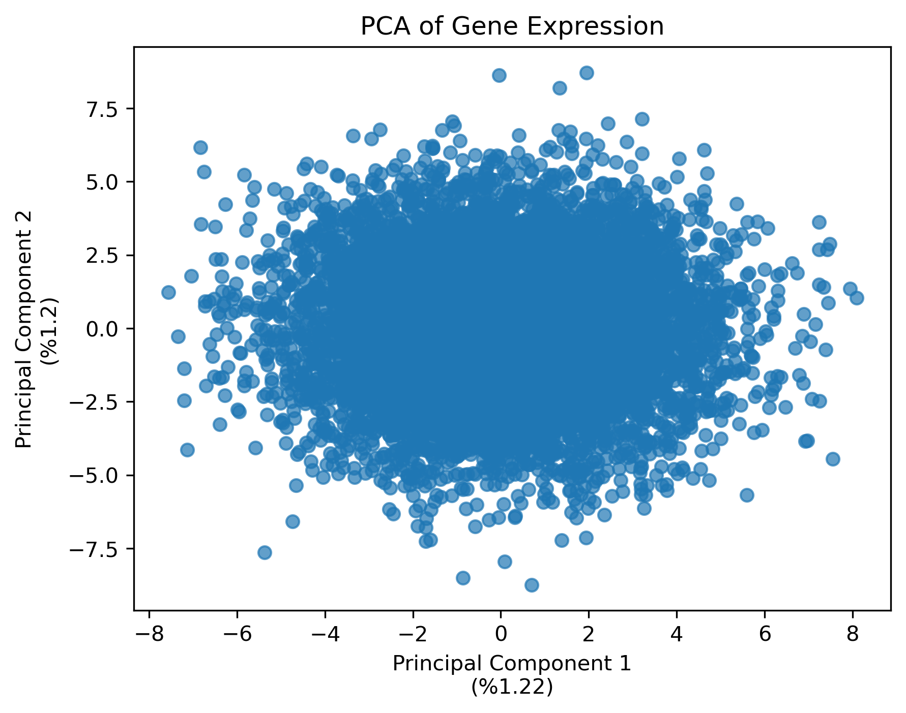

# Snakemake Workflow Example for Data Preprocessing and Visualization

## Overview
This project demonstrates a Snakemake workflow for preprocessing and visualizing biological data. The workflow automates the steps of data cleaning, statistical analysis and generating visualizations for datasets stored in the `data/` directory. 

*Provided data is a traning data and does not contain any real information, thus examples will not make any statistical sense.*

## Project Structure

```
snakemake_project_00
├── data
│   └── sample_dataset.csv
├── envs
│   └── environment.yml
├── README.md
├── results
├── scripts
│   ├── preprocess.py
│   └── visualize.py
└── Snakefile
```

## Workflow
### Rules
1. **Preprocess**:
   - Cleans the raw dataset (`data/sample_dataset.csv`).
   - Removes missing values, duplicates, and outliers.
   - Saves the preprocessed dataset to `data/preprocessed_sample_dataset.csv`.

2. **Visualize**:
   - Generates visualizations and statistical summaries:
     - PCA plot (`results/PCA_sample_dataset.png`)
     - Heatmap (`results/Heatmap_sample_dataset.png`)
     - Boxplot (`results/Boxplot_sample_dataset.png`)
     - Miscellaneous graph (`results/miscGraph_sample_dataset.png`)
     - Summary statistics (`results/Summary_sample_dataset.txt`)
     - P-value analysis (`results/PVAL_sample_dataset.txt`)

### Execution
To run the workflow:
1. Navigate to working directory:
    ```bash
    cd ~/snakemake_project_00
    ```

2. Create the Conda environment:
   ```bash
   conda env create -n snakemakeDummyEnv -f envs/environment.yml
   ```

3. Activate the environment:
   ```bash
   conda activate snakemakeDummyEnv
   ```

4. Execute the workflow:
   ```bash
   snakemake --cores 1 
   ```

## Dependencies
The workflow requires the following tools and libraries:
- **Conda**: Environment management
All libraries needed can be obtained via the `environment.yml` file in the `envs/` directory.
    - **Snakemake**: Workflow management
    - **Python**: Programming language 

    - **Other Libraries**:
        - pandas
        - numpy
        - matplotlib
        - seaborn
        - scikit-learn
        - statsmodels
        - scipy
        - sys
        - os

## Outputs
The results are saved in the `results/` directory:
- **Plots**:
  - PCA
  - Heatmap
  - Boxplot
  - A miscellaneous graph
- **Text Files**:
  - Summary statistics
  - P-value analysis

```
snakemake_project_00
├── data
│   ├── preprocessed_sample_dataset.csv
│   └── sample_dataset.csv
├── envs
│   └── environment.yml
├── README.md
├── results
│   ├── Boxplot_sample_dataset.png
│   ├── Heatmap_sample_dataset.png
│   ├── miscGraph_sample_dataset.png
│   ├── PCA_sample_dataset.png
│   ├── PVAL_sample_dataset.txt
│   └── Summary_sample_dataset.txt
├── scripts
│   ├── preprocess.py
│   └── visualize.py
└── Snakefile
```

## Example Output Files

### Plots
Below are examples of the plots generated by the workflow:

#### PCA Plot


#### Heatmap


#### Boxplot


#### Miscellaneous Graph


### Text Files
Below are snippets of the text files generated by the workflow:

#### Summary Statistics
```
       Column1    Column2    Column3
count  100.000    100.000    100.000
mean    50.123     30.456     70.789
std     10.123      5.456     15.789
min     10.000     20.000     50.000
max     90.000     40.000     90.000
```

#### P-Value Analysis
```
PVAL Information
================
Number of healthy samples:    50
Number of non-healthy samples:    50

First 5 PVALs:
[0.001, 0.02, 0.03, 0.0005, 0.01]

Significant PVALs (< 0.01):
[0.001, 0.0005]

Indices of significant PVALs (< 0.01):
[0, 3]

Significant PVALs (< 0.05):
[0.001, 0.02, 0.03, 0.0005, 0.01]

Indices of significant PVALs (< 0.05):
[0, 1, 3, 4]
```

## Customization
- Add new datasets to the `data/` directory.
- Modify the `Snakefile` to include additional preprocessing or visualization steps.

## Logs
Execution logs are stored in `.snakemake/log/`.

## License
*This project is intended for educational and training purposes only. It is not formally licensed for distribution or commercial use.*

## Contact
For questions or contributions, contact [Yavuz Selim Baştemur](mailto:yavuzsebe@gmail.com).